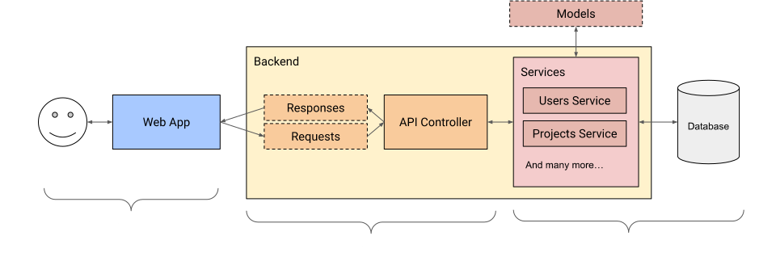

    

---

A platform for makers, hobbyists, students, and professionals to easily store and visualize data recorded from internet-connected devices like [Arduinos] and [Raspberry Pis].

- [Try it out](#try-it-out)
- [Motivation](#motivation)
- [Features](#features)
- [Building and Running](#building-and-running)
  - [Backend](#backend)
  - [Frontend](#frontend)
- [Tests](#tests)
- [Architecture](#architecture)
- [Licensing](#licensing)

## Try it out
You can try out trackr by navigating to [https://trackr.vldr.org](https://trackr.vldr.org).

**Note:** The demostration website is running in read-only mode, meaning that you cannot any changes. 

## Motivation

There exists a community of makers, students, hobbyists, and professionals who create and design systems that are capable of collecting sensor data like humidity, temperature, and atmospheric pressure.

These makers wish to store and visualize their sensor data, but there exist barriers in place like managing databases, web servers, etc.

As such, trackr sets out to make it easier for these makers to store and visualize their data.

## Features

- Fully open-source codebase.
- Graph and table visualizations of sensor data.
- Easy-to-use REST API that enables the storing and retrieval of sensor data.
- Aggregation of sensor data by month, days, and hours.
- Compatible with Raspberry Pis and Arduino devices.
- Slick and responsive web-interface.

## Building and Running

Currently, trackr consists of two components: the frontend and the backend.
The front end is the website that users interact with, whereas the back end is the REST API that responds to requests made by users through the front end.

### Backend

**Note:** When building or running, the Go server executable will use the `.env` file for its environment variables on runtime. Make sure this file exists when running the server executable.

#### Building

To build the backend, make sure you have [Go] installed and GCC installed.

1. From the root directory, navigate to the `backend/` directory.
2. Type `make`

Your build files will be located in the `bin/` directory.

#### Running

In addition to building, you can also run the backend in a development environment.
To run the backend, make sure you have [Go] installed and GCC installed.

1. From the root directory, navigate to the `backend/` directory.
2. Type `make run`
3. Press `Control + C` on your keyboard to exit.

### Frontend

#### Building

To build the frontend, make sure you have [NodeJS] installed.

**Note:** When building, React will use the `.env.production` file for its environment variables. Make sure this file exists when building&mdash;this file is only used when building.

1. From the root directory, navigate to the `frontend/` directory.
2. If it is your first time building the front end, type `make `clean`, otherwise, skip this step.
3. Type `make`

Your build files will be located in the `build/` directory.

#### Running

In addition to building, you can also run the frontend in a development environment.
To run the frontend, make sure you have [NodeJS] installed.

**Note:** When running, React will use the `.env.development` file for its environment variables. Make sure this file exists when running the frontend.

1. From the root directory, navigate to the `frontend/` directory.
2. Type `make run`
3. Press `Control + C` on your keyboard to exit.

## Tests

At the moment, trackr only has tests available for the backend component. There are two types of tests: database service implementation tests and API controller endpoint tests.

To run the tests:

1. From the root directory, navigate to the `backend/` directory.
2. Type `make test`

## Architecture

## Licensing

For more information, see ...

[raspberry pis]: https://www.raspberrypi.org/
[arduinos]: https://www.arduino.cc/
[nodejs]: https://nodejs.org/en/
[go]: https://go.dev/
